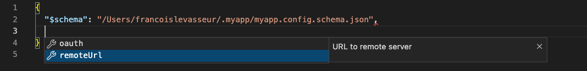

# Yargs Extra

Few additions to the library [yargs](https://github.com/yargs/yargs) including the ability to parse environment variables and create a json-schema from yargs options.

## Usage

Your TypeScript program could look like this:

```ts
import os from 'os'
import path from 'path'
import fs from 'fs'
import yargs, { asYargs, generateSchema, cleanupConfig, parseEnv } from '@bpinternal/yargs-extra'

const yargsSchema = asYargs({
  remoteUrl: {
    type: 'string',
    description: 'URL to remote server'
  },
  oauth: {
    type: 'boolean',
    description: 'Whether or not to use oauth'
  }
})

const jsonSchemaLocation = path.join(os.homedir(), '.myapp', 'myapp.config.schema.json')
const configFileLocation = path.join(process.cwd(), 'myapp.config.json')

const stringify = (x) => JSON.stringify(x, null, 2)

void yargs
  .command(
    'init',
    'Init configuration file',
    (yargs) => yargs.options({}),
    async () => {
      const jsonSchema = generateSchema(yargsSchema)
      fs.writeFileSync(jsonSchemaLocation, stringify(jsonSchema))
      fs.writeFileSync(configFileLocation, stringify({ $schema: jsonSchemaLocation }))
    }
  )
  .command(
    'build',
    'Build something',
    (yargs) => yargs.options(yargsSchema),
    async (yargsArgv) => {
      const yargsEnv = parseEnv(yargsSchema, 'MYAPP')
      const yargsFile = fs.existsSync(configFileLocation)
        ? JSON.parse(fs.readFileSync(configFileLocation, 'utf-8'))
        : undefined

      // cli args will override json config, which will also override env variables
      const resolved = cleanupConfig(yargsSchema, { ...yargsEnv, ...yargsFile, ...yargsArgv })
      console.log(resolved)

      // ...
    }
  )
  .help().argv
```

Using this program above, you can try out few different ways of passing arguments:

```bash
./myapp init # will create an empty config file
code ./myapp.config.json # will open your config file in vscode with intellisense

MYAPP_REMOTE_URL=http://lol.com ./myapp build # { remoteUrl: 'http://lol.com' }
MYAPP_REMOTE_URL=http://lol.com ./myapp build --oauth # { remoteUrl: 'http://lol.com', oauth: true }
MYAPP_REMOTE_URL=http://lol.com ./myapp build --remote-url http://localhost:3100 # { remoteUrl: 'http://localhost:3100' }
```

When opening the config file in vscode, you'll get intellisense:



## Disclaimer ⚠️

This package is published under the `@bpinternal` organization. All packages of this organization are meant to be used by the [Botpress](https://github.com/botpress/botpress) team internally and are not meant for our community. However, these packages were still left intentionally public for an important reason : We Love Open-Source. Therefore, if you wish to install this package feel absolutly free to do it. We strongly recomand that you tag your versions properly.

The Botpress Engineering team.

## Licensing

This software is protected by the same license as the [main Botpress repository](https://github.com/botpress/botpress). You can find the license file [here](https://github.com/botpress/botpress/blob/master/LICENSE).
